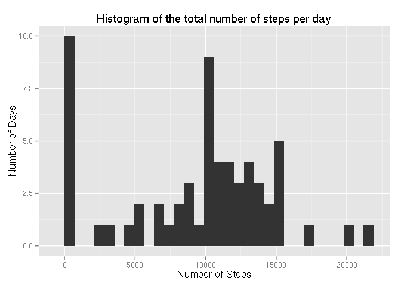
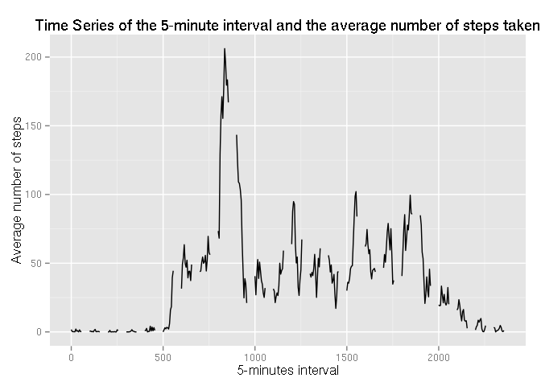
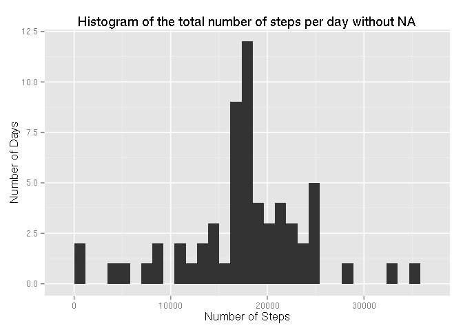
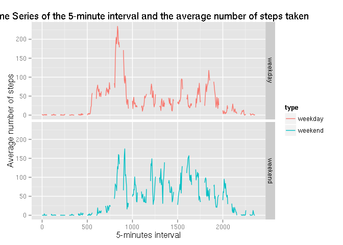

# Reproducible Research: Peer Assessment 1


## Loading and preprocessing the data
First, we will load directly from the ZIP archive the CSV file.
We use the [unz](https://stat.ethz.ch/R-manual/R-devel/library/base/html/connections.html) function.


```r
data <- read.csv(unz("activity.zip", "activity.csv"), header = T, na.strings="NA", stringsAsFactors = FALSE)
```

For convinience, we transform the strings date to real dates using [lubridate](http://cran.r-project.org/web/packages/lubridate/vignettes/lubridate.html)


```r
library(lubridate)
data$date <- ymd(data$date)
```

And we add missing intervals or days.

```r
filled <- expand.grid(date = seq(from = min(data$date), to = max(data$date), by = "day"), interval = seq(min(data$interval), max(data$interval), by = 5))
data <- merge(filled, data, all = TRUE)
```


## What is mean total number of steps taken per day?

To compute the mean total number of steps per day, we will first compute per day the total number of steps.
We rely on the [dplyr](http://cran.rstudio.com/web/packages/dplyr/vignettes/introduction.html) package.


```r
library(plyr, warn.conflicts = FALSE, quietly=TRUE)
library(dplyr, warn.conflicts = FALSE, quietly=TRUE)
totalStepsPerDay <- data %>% group_by(date) %>% summarise(total = sum(steps, na.rm = TRUE)) %>% select(total)
```

Then we show a histogram of the total number of steps per day, using [ggplot2](http://ggplot2.org/)

```r
library(ggplot2, warn.conflicts = FALSE, quietly=TRUE)
qplot(total, data=totalStepsPerDay, geom="histogram", xlab = "Number of Steps", ylab = "Number of Days", main = "Histogram of the total number of steps per day") 
```

 

And finally the mean and the median.

```r
mean(totalStepsPerDay$total)
```

```
## [1] 9354.23
```

```r
median(totalStepsPerDay$total)
```

```
## [1] 10395
```


## What is the average daily activity pattern?
We look at 5-minutes intervals.
We compute per 5-minute interval the average number of steps taken, averaged across all days.

```r
averageStepsPerInterval <- data %>% group_by(interval) %>% summarise(mean = mean(steps, na.rm = TRUE))
ggplot(averageStepsPerInterval, aes(interval, mean)) + geom_line() + xlab("5-minutes interval") + ylab("Average number of steps") + ggtitle("Time Series of the 5-minute interval and the average number of steps taken")
```

 

The five-minute interval, which contain the maximum number of steps in average across all the days is 835.

## Imputing missing values

We evaluate the bias induced by NA values.
First, we calculate the total number of missing values in the dataset.

```r
sum(is.na(data$steps))
```

```
## [1] 13528
```

To fill the NAs, we use the mean of the interval.

```r
meanCol <- ddply(meanCol,.(interval),transform, mean = mean(steps, na.rm=TRUE))
meanCol <- meanCol %>% transform(steps = ifelse(is.na(steps), mean, steps))
sum(is.na(meanCol$steps))
```

```
## [1] 0
```

Now we plot this histogram of taken steps again.

```r
totalStepsPerDayWithNA <- meanCol %>% group_by(date) %>% summarise(total = sum(steps, na.rm = TRUE)) %>% select(total)
qplot(total, data=totalStepsPerDayWithNA, geom="histogram", xlab = "Number of Steps", ylab = "Number of Days", main = "Histogram of the total number of steps per day without NA") 
```

 

And finally the mean and the median.

```r
mean(totalStepsPerDayWithNA$total)
```

```
## [1] 17644.59
```

```r
median(totalStepsPerDayWithNA$total)
```

```
## [1] 17644.59
```

Now the mean and the median are the same.
We also see that the number of steps equals to zero if far less than previously.


## Are there differences in activity patterns between weekdays and weekends?

We now at activity patterns between weekdays and weekends.
First we add a factor variable indicating if a day is a weekday or a weekend.

```r
perDay <- data %>% transform(type = ifelse(weekdays(date) %in% c("Saturday" , "Sunday") , "weekend", "weekday")) %>% transform(type = as.factor(type))
```

And we plot using ggplot facet_grid.

```r
averageStepsPerIntervalPerDay <- perDay %>% group_by(type, interval) %>% summarise(mean = mean(steps, na.rm = TRUE))
ggplot(averageStepsPerIntervalPerDay, aes(interval, mean, colour=type)) + geom_line() + facet_grid(type ~ .) + xlab("5-minutes interval") + ylab("Average number of steps") + ggtitle("Time Series of the 5-minute interval and the average number of steps taken")
```

 

The weekend, the person generally gets up later, and walks "constantly" around 100 steps every 5 minutes intervals.
The week, there is a spike around noon, and the person walks less at the end of the day.
